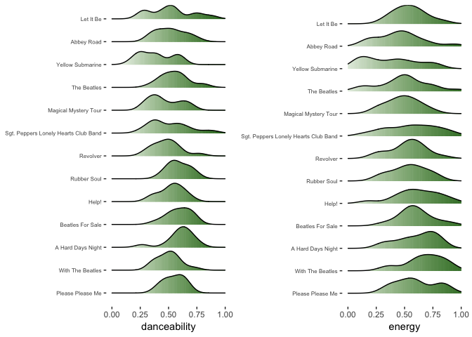
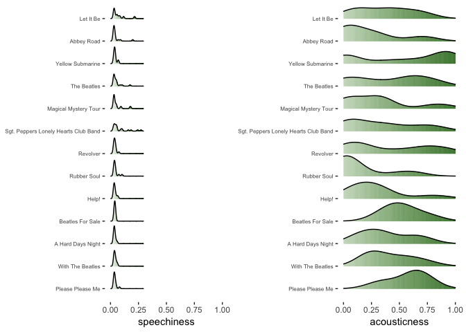
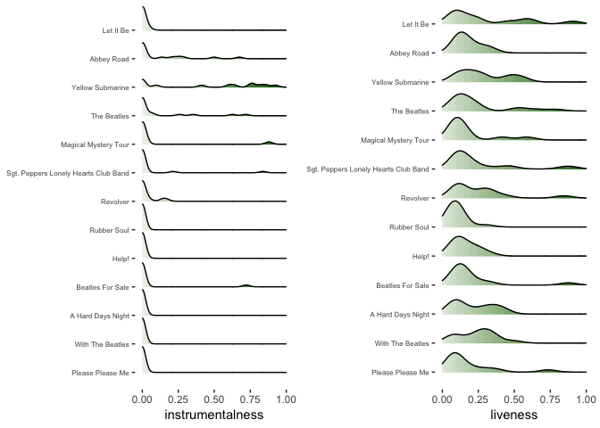
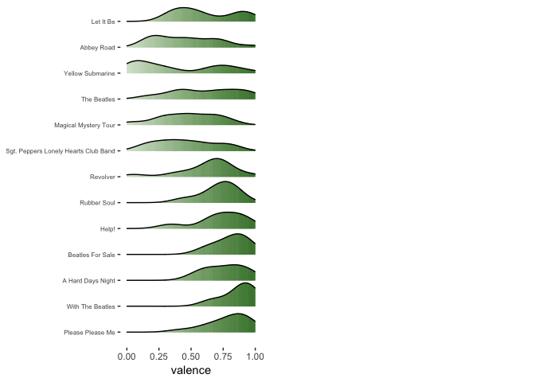
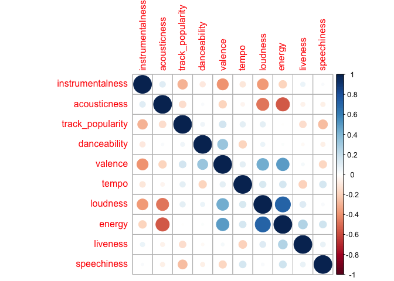

Exploring spotify API with The Beatles
================

``` r
beatles <- read_csv("../data/beatles.csv")

john_lennon <- read_csv("../data/john_lennon.csv") 

paul_mc <- read_csv("../data/paul_mc.csv")
```

I thought data at Spotify API looked fun and wanted to explore a bit. I fetched the data through `spotifyr` package. I thought about which artist's data to look at and first artist that popped into my head was The Beatles. While I listen to their songs occassionally, I am not a beatles fanatic but there's so much information about them on the web that thought I could throw some interesting questions.

Spotify data contains some very interesting features. You can find features such as `danceability`, `track popularity`,

Description of the track features can be found at: <https://developer.spotify.com/documentation/web-api/reference/tracks/get-audio-features/>

An Interesting variable is valence: A measure from 0.0 to 1.0 describing the musical positiveness conveyed by a track. Tracks with high valence sound more positive (e.g. happy, cheerful, euphoric), while tracks with low valence sound more negative (e.g. sad, depressed, angry).

Its interesting because happiness is a subjective feeling. Let's see how it is described numerically.

Exploring Features
------------------

``` r
beatles = mutate(beatles, album_name = gsub("\\s*\\([^\\)]+\\)","",beatles$album_name))

detect_song <- function(song) {
  beatles[str_detect(beatles$track_name, regex(song, ignore_case = TRUE)) == 1,] 
}

map_df(c("twist and shout", "ob-la-di", "yesterday", "blackbird", "can't buy me love", "I Will"), detect_song) %>%
  dplyr::select(track_name,danceability, valence, energy, acousticness, loudness, instrumentalness, tempo) %>%
  knitr::kable()
```

| track\_name                             |  danceability|  valence|  energy|  acousticness|  loudness|  instrumentalness|    tempo|
|:----------------------------------------|-------------:|--------:|-------:|-------------:|---------:|-----------------:|--------:|
| Twist And Shout - Remastered 2009       |         0.482|    0.937|   0.849|         0.641|    -9.198|          7.70e-06|  124.631|
| Ob-La-Di, Ob-La-Da - Remastered 2009    |         0.818|    0.975|   0.728|         0.232|    -8.331|          6.42e-02|  113.059|
| Yesterday - Remastered 2009             |         0.332|    0.315|   0.179|         0.879|   -11.830|          0.00e+00|   96.529|
| Blackbird - Remastered 2009             |         0.686|    0.372|   0.127|         0.754|   -14.361|          1.41e-05|   93.699|
| Can't Buy Me Love - Remastered 2009     |         0.483|    0.842|   0.677|         0.283|    -5.910|          0.00e+00|  170.720|
| I Will - Remastered 2009                |         0.631|    0.832|   0.387|         0.742|   -11.529|          4.06e-04|  103.110|
| So I selected few songs that I was curi |   ous to see.|         |        |              |          |                  |         |

-   *twist and shout* - very cheerful danceable song in my opinion? - very high valence, nearly one
-   *Ob-La-Di, Ob-La-Da* - also with a pretty happy beat - very higy danceability and valence
-   *Yesterday* - kind of a sad moody song and we can see that the valence is on the lower side.
-   *Blackbird* - slow but encouraging song in my opinion but pretty low in valence and energy but actually pretty high in danceability.
-   *Can't buy me love* - surprisingly black bird is more danceable but much high in energy. I put in this song becuase it's a upbeat song but not a "happy" song. It's not the highest in valence but not low either.
-   *I will* - This song is not upbeat but a "happy" song. We can see that the energy is in the lower side but valence is high.

General notes \* acousticness to me seems just how much acoustic guitar is used? \* instrumentalness - Predicts whether a track contains no vocals. so makes sense that they are low

Overall, I think valence is doing a pretty good job on picking up "happiness" of a song. I am impressed!

Let's graph it
--------------

``` r
ordered_albums = factor(beatles$album_name)
ordered_albums = factor(ordered_albums,levels(ordered_albums)[c(7,12,1,3,4,9,8,10,6,11,13,2,5)])
beatles$album_name = ordered_albums

album_plot <- function(df, feature) {

  feature = quo(!! sym(feature))
   
    df %>%
    ggplot(aes(x = (!!feature), y = album_name, fill = ..x..)) + 
    geom_density_ridges_gradient(scale = 0.9) + 
    scale_fill_gradient(low = "white", high = "dark green") +
    theme(panel.background = element_rect(fill = "white")) +
    theme(plot.background = element_rect(fill = "white")) +
    xlim(0,1) +
    theme(legend.position = "none")+
  theme(axis.title.y=element_blank(),
        axis.text.y = element_text(size = 6))
}

plot_features <- function(df) {
  
  names = df[,c(9, 10, 14:18)] %>% colnames()
  
  plots = list() 
  
  for (i in 1:length(names)){
  
  p = album_plot(df, names[i])
  plots[[i]] <- p
  }

  for (i in c(1,3,5,7)){
  multiplot(plotlist = plots[i:(i+1)], cols = 2)
  }
 
}

plot_features(beatles)
```



    ## NULL

Here, you can see ridges density graphs with albums ordered by their realease date, with lowest being the oldest. There are some noticeable changes. \* They had higher valence (positivity) in their earlier albums.

-   The album 'Yellow Submarine' seems to stand out compared to the rest of their albums. Its distribution in most of the features such as danceability, instrumentalness, speechiness, acousticness. It makes sense as part of the album is written by The Beatles and the remainder of the album is a re-recording of the film's orchestral soundtrack by the band's producer, George Martin.\[<https://en.wikipedia.org/wiki/Yellow_Submarine_(album)>\]

-   When making this graph, I was wondering if the values pick up The Beatles psychedelic phase. They say that The Beatles's psychedelic songs are spread across few albums but people say it started from the album 'Revolver' and went on to 'Sgt. Pepper's Lonely Hearts Club Band', Magical Mystery Tour, and 'Yellow Submarine. You can see definite shift in valence as mentioned above after Revolver and also slightly in danceability and acousticness. <https://ultimateclassicrock.com/beatles-psychedelic-songs/>

Let's explore the relationship between these features through a correlation plot.

``` r
beatles[,c(9, 10, 12, 14:19, 23)] %>%
  cor() %>%
  corrplot::corrplot(method = "circle", order = "AOE")
```



So for The beatles, energy has positive correlation with acousticness and negative relationship with valence. Also, we can see that "louder" the song is it leads to the song having low energy but high acousticness. Surprisingly danceability has an inverse relationship with valence. I also threw in the track\_popularity but none of the variables seem to have a strong linear relationship with popularity. Perhaps, instrumentalness and speechiness have slightly negative relationship with popularity.

Q. Do features have (linear) relationship with popularity?
----------------------------------------------------------

``` r
mean_beatles <- beatles %>%
  group_by(album_name, album_release_date) %>% 
  summarise(mean_valence = mean(valence),
            mean_energy = mean(energy),
            mean_danceability = mean(danceability),
            mean_album_popularity = mean(album_popularity)
            ) %>%
  arrange(album_release_date)

# album popularity
mean_beatles %>%
  arrange(desc(mean_album_popularity)) %>%
  kable() 
```

| album\_name                          | album\_release\_date |  mean\_valence|  mean\_energy|  mean\_danceability|  mean\_album\_popularity|
|:-------------------------------------|:---------------------|--------------:|-------------:|-------------------:|------------------------:|
| Abbey Road                           | 1969-09-26           |      0.4591765|     0.4571765|           0.5180000|                       78|
| The Beatles                          | 1968-11-22           |      0.6143500|     0.4916650|           0.5522500|                       73|
| Please Please Me                     | 1963-03-22           |      0.7871429|     0.5997857|           0.5479286|                       72|
| Help!                                | 1965-08-06           |      0.7267143|     0.6109286|           0.5280000|                       72|
| Let It Be                            | 1970-05-08           |      0.6146667|     0.5459167|           0.5204167|                       72|
| Rubber Soul                          | 1965-12-03           |      0.7163571|     0.5393571|           0.5877857|                       71|
| Revolver                             | 1966-08-05           |      0.6261714|     0.5305714|           0.4824286|                       69|
| A Hard Days Night                    | 1964-07-10           |      0.7614615|     0.6095385|           0.6014615|                       68|
| Magical Mystery Tour                 | 1967-11-27           |      0.4736182|     0.4865455|           0.4669091|                       68|
| With The Beatles                     | 1963-11-22           |      0.8714286|     0.6761429|           0.5003571|                       65|
| Beatles For Sale                     | 1964-12-04           |      0.8120000|     0.5964286|           0.5922857|                       62|
| Sgt. Peppers Lonely Hearts Club Band | 1967-05-26           |      0.4579000|     0.5634000|           0.5056500|                       61|
| Yellow Submarine                     | 1969-01-17           |      0.3870538|     0.3760462|           0.3884615|                       52|

We can see that the more popular albums have mean valence values in the 0.45 - 0.78 range and have mean energy and danceability around 0.5.

I tried making linear regression models to explain track\_popularity with the variables in the dataset.

``` r
beatles_top <- beatles %>% 
  top_n(n = 15, wt = track_popularity) %>%
  arrange(desc(track_popularity))

beatles_popu_lm <-  lm(track_popularity ~ danceability + energy + loudness + mode + speechiness + acousticness + instrumentalness + liveness + valence + tempo + duration_ms + time_signature, data = beatles)
beatles_popu_lm %>% 
  broom::tidy() %>%
  knitr::kable(digits = 3) 
```

| term             |  estimate|  std.error|  statistic|  p.value|
|:-----------------|---------:|----------:|----------:|--------:|
| (Intercept)      |    41.633|     10.120|      4.114|    0.000|
| danceability     |     4.039|      5.668|      0.713|    0.477|
| energy           |    -6.306|      6.343|     -0.994|    0.321|
| loudness         |    -0.072|      0.384|     -0.188|    0.851|
| modeminor        |     1.736|      1.765|      0.984|    0.327|
| speechiness      |   -71.597|     20.053|     -3.570|    0.000|
| acousticness     |    -7.395|      3.002|     -2.464|    0.015|
| instrumentalness |   -13.464|      3.981|     -3.382|    0.001|
| liveness         |    -3.738|      4.139|     -0.903|    0.368|
| valence          |     0.065|      3.982|      0.016|    0.987|
| tempo            |     0.048|      0.027|      1.798|    0.074|
| duration\_ms     |     0.000|      0.000|      0.620|    0.536|
| time\_signature  |     3.323|      1.392|      2.388|    0.018|

``` r
beatles_popu_lm %>% 
  broom::glance() %>%
  knitr::kable() 
```

|       |  r.squared|  adj.r.squared|     sigma|  statistic|  p.value|   df|    logLik|       AIC|       BIC|  deviance|  df.residual|
|-------|----------:|--------------:|---------:|----------:|--------:|----:|---------:|---------:|---------:|---------:|------------:|
| value |  0.2310714|      0.1789406|  9.383781|   4.432534|  3.4e-06|   13|  -688.272|  1404.544|  1450.002|   15585.8|          177|

Based on this first model, I will remove danceability, modeminor, valence, tempo, and duration\_ms.

``` r
beatles_popu_lm2 <-  lm(track_popularity ~ energy + loudness + speechiness + acousticness + instrumentalness + liveness + time_signature, data = beatles)
beatles_popu_lm2 %>% 
  broom::tidy() %>%
  knitr::kable(digits = 3) 
```

| term             |  estimate|  std.error|  statistic|  p.value|
|:-----------------|---------:|----------:|----------:|--------:|
| (Intercept)      |    53.114|      7.685|      6.911|    0.000|
| energy           |    -5.994|      5.639|     -1.063|    0.289|
| loudness         |    -0.018|      0.379|     -0.047|    0.962|
| speechiness      |   -66.311|     18.615|     -3.562|    0.000|
| acousticness     |    -7.422|      2.908|     -2.552|    0.012|
| instrumentalness |   -13.793|      3.749|     -3.679|    0.000|
| liveness         |    -5.878|      3.968|     -1.481|    0.140|
| time\_signature  |     3.050|      1.330|      2.293|    0.023|

``` r
beatles_popu_lm2 %>% 
  broom::glance() %>%
  knitr::kable() 
```

|       |  r.squared|  adj.r.squared|     sigma|  statistic|  p.value|   df|     logLik|       AIC|       BIC|  deviance|  df.residual|
|-------|----------:|--------------:|---------:|----------:|--------:|----:|----------:|---------:|---------:|---------:|------------:|
| value |    0.21253|      0.1822427|  9.364892|    7.01713|    2e-07|    8|  -690.5356|  1399.071|  1428.294|  15961.62|          182|

Surprisingly speechiness has a p-value of 0 with a relatively large coefficient. Speechiness detects the presence of spoken words in a track (Values above 0.66 describe tracks that are probably made entirely of spoken words.). It makes sense that more speech-like the track is, it won't be so popular.

It is also interesting to see that The Beatles's track popularity had negative relationship with energy, acousticness, instrumentalness, and liveness.

But this is just looking at the linear relationship between the features and popularity. As the most popular album had values of some features around 0.5, maybe if we try modeling with non-linear models like trees it will fit our data better.
